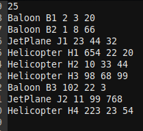

# avaj-launcher
Simple java program that simulates traffic in an airport according to a config file. THe program was written following an UML class diagram.

## usage

`sh run.sh [config.file]` will run the simulation according to the configuration file. The program will generate a simulation.txt which will describes the takeoff / landing / weather changes for each aircraft.

## configuration file

The first line of the configuration file contain a positive integer representing the number of times the simulation is run. Each following line represent an aircraft that will be part of the smulation, with this format: TYPE(Baloon, Jetplane, Helicopter) NAME LONGITUDE LATITUDE HEIGHT.

